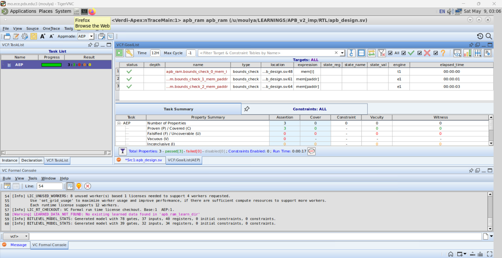
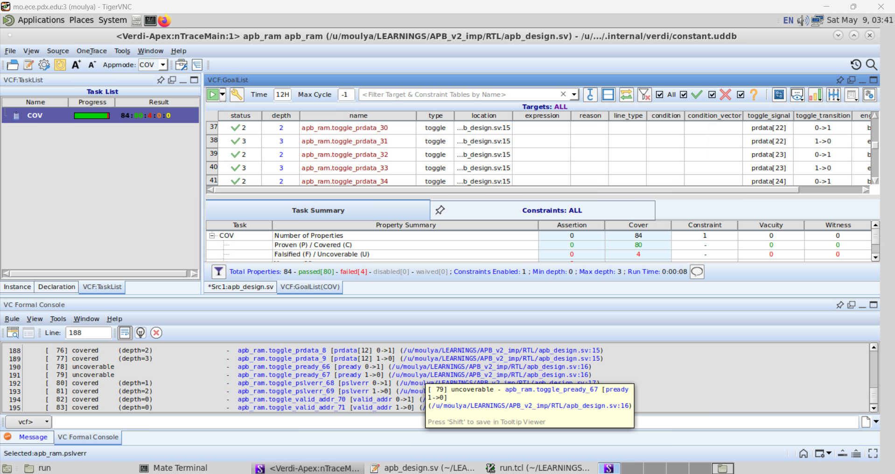
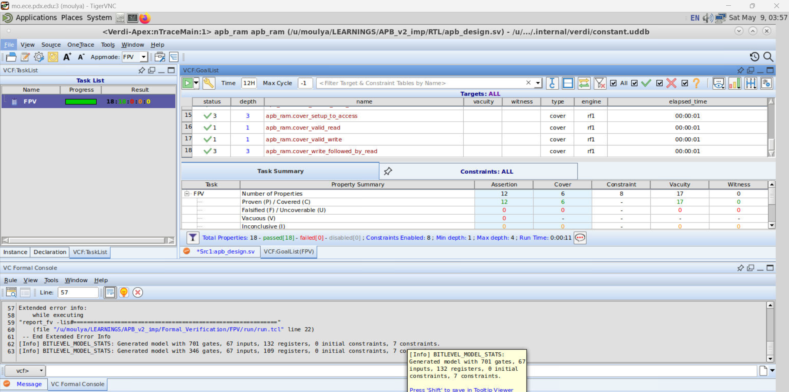
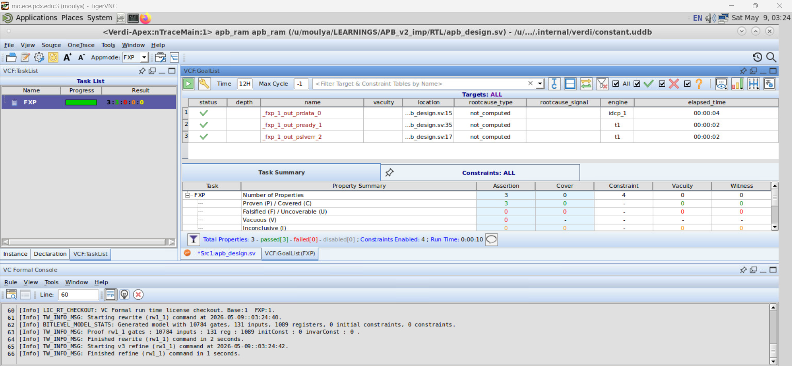

# Formal Verification — APB RAM using Synopsys VC Formal

> Complete formal verification closure of a parameterized APB Slave RAM using **Synopsys VC Formal** with assertion-based verification, formal coverage analysis, X-propagation analysis, automatic property extraction, and sequential equivalence checking.

---

# Table of Contents

1. [Overview](#overview)
2. [Formal Verification Apps Used](#formal-verification-apps-used)
3. [Verification Methodology](#verification-methodology)
4. [Assertions Verified](#assertions-verified)
5. [Deadlock & Livelock Verification](#deadlock--livelock-verification)
6. [Formal Verification Results](#formal-verification-results)
7. [Project Structure](#project-structure)
8. [Tools Used](#tools-used)

---

# Overview

This project extends the APB RAM UVM verification environment with complete **formal verification closure** using **Synopsys VC Formal**.

The design was formally verified for:

- APB protocol correctness
- Assertion proof convergence
- Deadlock/livelock freedom
- X-propagation safety
- Structural RTL bug analysis
- Formal coverage closure
- Sequential equivalence verification

The verification environment combines:

```text
RTL Design + UVM Verification + Assertion-Based Verification + Formal Verification
````

---

# Formal Verification Apps Used

| App | Purpose                         |
| --- | ------------------------------- |
| FPV | Formal Property Verification    |
| FCA | Formal Coverage Analysis        |
| FXP | Formal X-Propagation Analysis   |
| AEP | Automatic Extracted Properties  |
| SEQ | Sequential Equivalence Checking |

---

# Verification Methodology

The APB RAM was verified using:

* SystemVerilog Assertions (SVA)
* Assumptions for APB master protocol behavior
* Assertions for slave protocol correctness
* Cover properties for reachability analysis
* Deadlock/livelock verification
* X-propagation analysis
* Formal coverage closure

The formal environment included:

* APB protocol legality constraints
* Stable control/address/data assumptions
* Functional correctness assertions
* Liveness properties
* Reachability covers

---

# Assertions Verified

## APB Protocol Assertions

* PENABLE legality checks
* SETUP → ACCESS progression
* ACCESS completion verification
* PREADY correctness
* Stable address during ACCESS
* Stable control/data during ACCESS

---

## Functional Assertions

* Valid address → PSLVERR remains LOW
* Invalid address → PSLVERR asserts HIGH
* PRDATA validity checks
* No X/Z propagation on outputs
* Output safety verification

---

# Deadlock & Livelock Verification

The following liveness properties were formally verified:

* No deadlock in SETUP phase
* No deadlock in ACCESS phase
* No livelock between SETUP and ACCESS
* Guaranteed APB transfer progression
* Bounded ACCESS completion

---

# Cover Properties

Reachability was formally verified for:

* Valid read transactions
* Valid write transactions
* Invalid address error response
* Full APB transfer flow
* Write followed by read scenarios

---

# Formal Verification Results

### AEP (Automatic Extracted Properties) — Structural RTL Analysis:



### FXP (Formal X-Propagation Analysis) — X-State Propagation Verification:


### FCA (Formal Coverage Analysis) — Coverage Reachability & Closure:



### FPV (Formal Property Verification) — Assertion Proof Results:



### SEQ (Sequential Equivalence Checking) — RTL Equivalence Verification:



---

# Formal Verification Outcomes

| Verification App | Result                          |
| ---------------- | ------------------------------- |
| FPV              | All assertions proven           |
| FCA              | Coverage closure achieved       |
| FXP              | No X-propagation issues         |
| AEP              | No structural RTL issues        |
| SEQ              | Sequential equivalence verified |

---

# Key Achievements

* Complete assertion proof convergence
* Exhaustive APB protocol verification
* Deadlock/livelock formally verified
* Formal X-propagation clean
* Reachability formally analyzed
* Structural RTL bug analysis completed
* Simulation + formal verification closure achieved

---

# Project Structure

```text
Formal_Verification/
├── README.md
│
├── Assertions/
│   └── apb_assertions.sv
│
├── FPV/
│   ├── run.tcl
│   └── apb_fpv.png
│
├── FCA/
│   ├── run.tcl
│   └── apb_fca.png
│
├── FXP/
│   ├── run.tcl
│   └── apb_fxp.png
│
├── AEP/
│   ├── run.tcl
│   └── apb_aep.png
│
├── SEQ/
    ├── run.tcl
    └── apb_seq.png

```

---

# Tools Used

| Tool                           | Purpose                      |
| ------------------------------ | ---------------------------- |
| Synopsys VC Formal             | Formal Verification          |
| SystemVerilog Assertions (SVA) | Assertion-Based Verification |
| QuestaSim 10.6b                | Simulation                   |
| UVM 1.1d                       | Simulation Verification      |
| Linux                          | Development Environment      |

---

# Author

**Moulya**
Masters Student — ECE, USA
RTL Design • UVM Verification • Formal Verification

```
```
