# APB RAM — Complete UVM Verification Environment
> **Advanced Peripheral Bus (APB) Slave RAM** verified using a full **UVM Testbench** with functional and code coverage closure on **QuestaSim 10.6b**

---

## Table of Contents
1. [Project Overview](#project-overview)
2. [APB Protocol Background](#apb-protocol-background)
3. [Signal Description](#signal-description)
4. [APB Operating States (FSM)](#apb-operating-states-fsm)
5. [Timing Diagrams](#timing-diagrams)
6. [DUT Architecture](#dut-architecture)
7. [UVM Testbench Architecture](#uvm-testbench-architecture)
8. [File Structure](#file-structure)
9. [Coverage Results](#coverage-results)
10. [How to Run](#how-to-run)
11. [Test Suite](#test-suite)
12. [Tools Used](#tools-used)

---

## Project Overview

This project implements a **complete UVM-based functional verification environment** for an APB Slave RAM. The verification environment includes:

- Full **UVM 1.2** Testbench with all standard components
- **5 directed + random tests** targeting different scenarios
- **100% Functional Coverage** closure
- **RTL Code Coverage** (Branch, Statement, Toggle, FSM, Condition, Expression)
- **Self-checking Scoreboard** with reference model
- Clean **package-based file structure** following industry standards

---

## APB Protocol Background

**APB (Advanced Peripheral Bus)** is part of the **AMBA (Advanced Microcontroller Bus Architecture)** family introduced by ARM in 1996.

### AMBA Family:
```
AMBA
├── ASB  (Advanced System Bus)
├── AHB  (Advanced High-performance Bus)
├── APB  (Advanced Peripheral Bus)  ← This Project
└── AXI  (Advanced eXtensible Interface)
```

### Key Characteristics:
| Property | Value |
|---|---|
| Type | Non-Pipelined |
| Transfer cycles | Minimum 2 cycles (SETUP + ACCESS) |
| Data width | 32-bit |
| Address width | 32-bit |
| Clock edge | Rising edge only |
| Reset | Active Low (PRESETn) |
| Use case | Low bandwidth peripherals (UART, Timer, GPIO, Keypad) |

### APB Evolution:
| Version 	 | Year      | Signals            |
|------------|-----------|--------------------|
| APB / APB2 | 1995/1999 | 8 signals          |
| APB v1.0   | 2003      | 8+2 = 10 signals   |
| APB v2.0   | 2010      | 8+2+2 = 12 signals |

### AMBA Bus Architecture:
```
┌─────────────────────────────────────────────────────┐
│  High Performance ARM Processor                     │
└──────────────┬──────────────────────────────────────┘
               │ AHB / AXI (High Bandwidth)
    ┌──────────▼──────────┐
    │   AHB to APB Bridge │ ← Only APB Master in system
    └──────────┬──────────┘
               │ APB (Low Bandwidth)
    ┌──────────▼──────────────────────────┐
    │  APB Decoder                        │
    ├──────────┬──────────┬───────────────┤
    │  UART    │  Timer   │  Keypad  │ PIO│
    └──────────┴──────────┴───────────────┘
```

> **Note:** APB Bridge acts as AHB Slave (to the Core Master) AND APB Master (to peripherals). AHB/AXI → APB communication is **Half Duplex** at peripheral level.

---

## Signal Description

| Signal    | Direction | Width |           Description                                  |
|-----------|-----------|-------|--------------------------------------------------------|
| `PCLK`    | Input     | 1     | System clock — all transitions on rising edge          |
| `PRESETn` | Input     | 1     | Active Low asynchronous reset                          |
| `PSELx`   | Input     | 1     | Slave select — asserted by master to select this slave |
| `PENABLE` | Input     | 1     | Indicates ACCESS phase — second cycle of transfer		 |
| `PWRITE`  | Input     | 1     | HIGH = Write transfer, LOW = Read transfer 			 |
| `PADDR`   | Input     | 32    | Address bus from Master to Slave						 |
| `PWDATA`  | Input     | 32    | Write data bus from Master to Slave 					 |
| `PRDATA`  | Output    | 32    | Read data bus from Slave to Master 					 |
| `PREADY`  | Output    | 1     | Slave ready — LOW inserts wait states                  |
| `PSLVERR` | Output    | 1     | HIGH = Transfer error, LOW = Transfer success          |

> **APB protocol supports single word, 32-bit data access only.**

---

## APB Operating States (FSM)

The APB protocol operates in **3 states:**

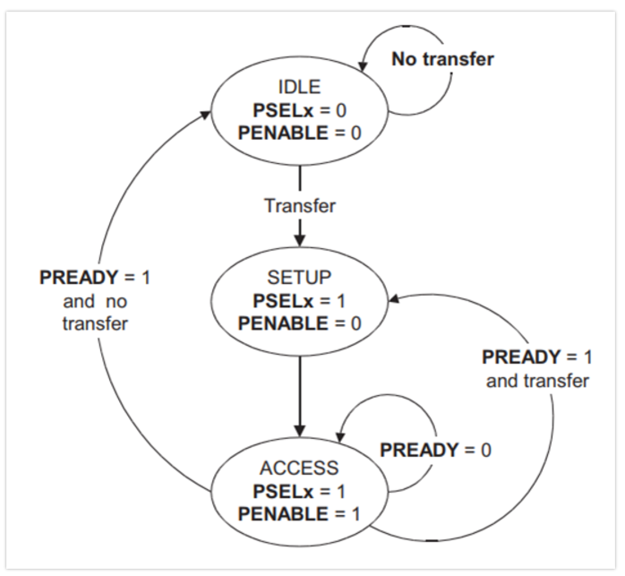

### State Descriptions:

**IDLE:**
- Default state of APB
- `PSELx = 0`, `PENABLE = 0`
- No transfer in progress

**SETUP:**
- Transfer required — `PSELx` asserted by master
- Bus stays in SETUP for **exactly 1 clock cycle**
- Slave must sample address and control in SETUP itself
- Always moves to ACCESS on next rising edge

**ACCESS:**
- `PENABLE` asserted — indicates second cycle
- `PADDR`, `PWRITE`, `PSELx`, `PWDATA` must remain **stable**
- `PREADY=1` → transfer completes at next rising edge
- `PREADY=0` → wait states inserted (transfer extends)

---

## Timing Diagrams

### Write Transfer — Without Wait States:
- T1: Master drives PADDR, PWDATA, PWRITE, PSELx → **SETUP phase begins**
- T2: PENABLE asserted → **ACCESS phase begins**
- T3: Transfer completes, PENABLE deasserted

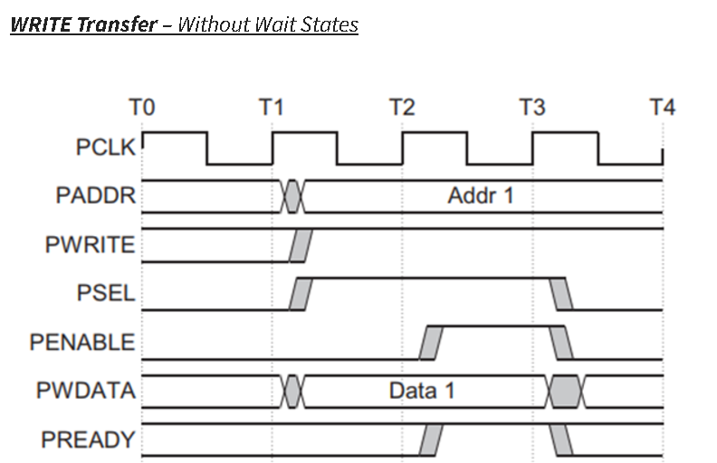

---

### Write Transfer — With Wait States:
- PREADY=LOW during ACCESS → slave inserts wait states
- All signals must remain **stable** while PREADY=LOW

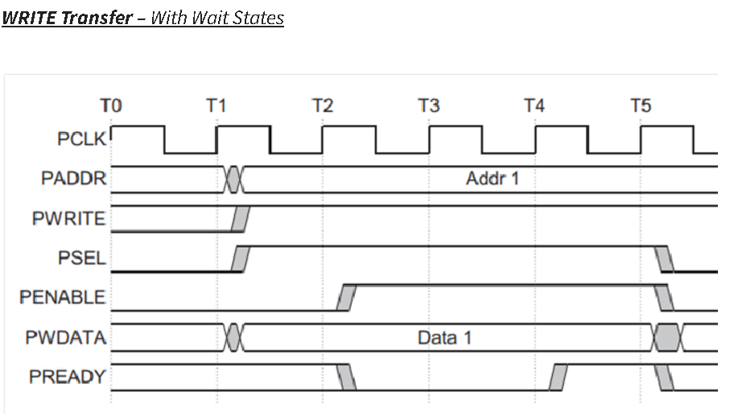

---

### Read Transfer — Without Wait States:
- Slave must provide PRDATA **before end of ACCESS phase** (T3)

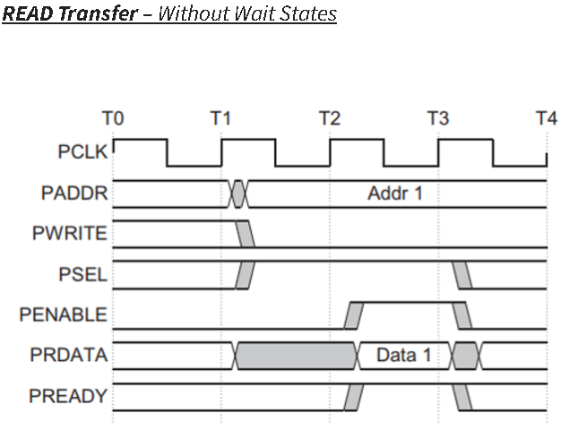

---

### Read Transfer — With Wait States:
- PREADY=LOW → slave not ready, transfer extended
- PRDATA must be valid when PREADY finally goes HIGH

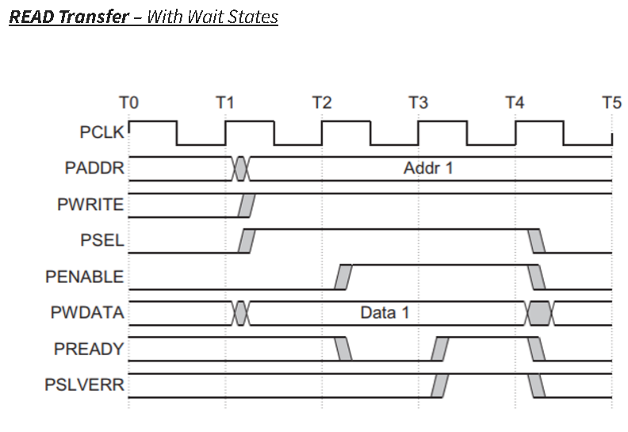

---

### Error Response — Read:
- `PSLVERR` is only valid when `PSELx=1`, `PENABLE=1`, `PREADY=1`
- In this project: `PSLVERR=1` when `PADDR >= 32` (out of bounds)

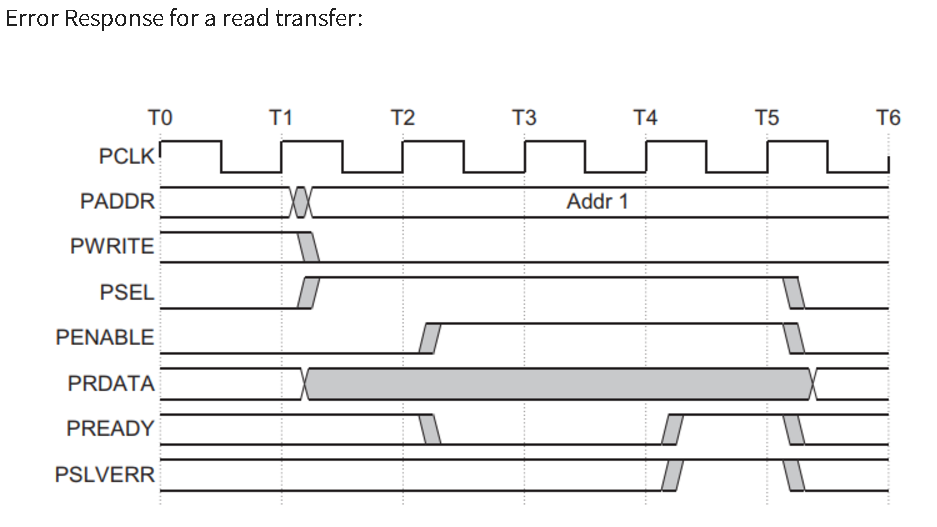

---

### Error Response — Write:

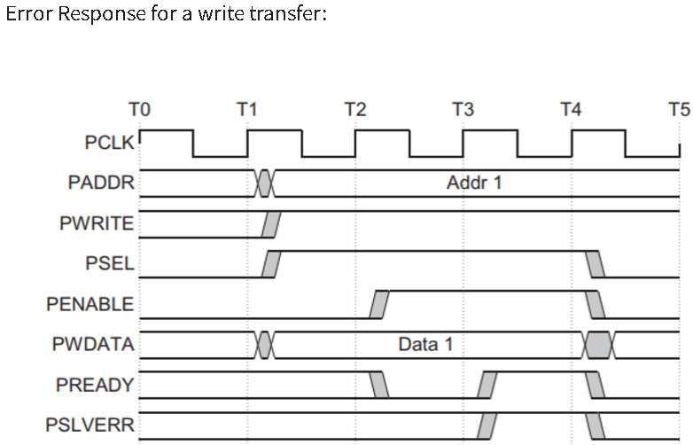

---

## DUT Architecture

### APB RAM Module:
```
         ┌──────────────────────────────┐
PCLK ───►│                              │
PRESETn─►│         APB RAM              ├──► PRDATA [31:0]
PSELx ──►│                              ├──► PREADY
PENABLE─►│    32 x 32-bit Memory        ├──► PSLVERR
PWRITE ─►│                              │
PADDR ──►│    FSM: IDLE→SETUP→ACCESS    │
PWDATA ─►│                              │
         └──────────────────────────────┘
```

### RTL FSM Implementation:
| State | Condition | Next State | Action |
|---|---|---|---|
| IDLE | `PSELx=1, PENABLE=0` | SETUP | — |
| IDLE | `PSELx=0` | IDLE | `PSLVERR=0` |
| SETUP | Always | ACCESS | Read data if valid addr |
| SETUP | `PADDR>=32` | ACCESS | `PSLVERR=1` |
| ACCESS | `PSELx=0` | IDLE | Write data if valid addr |
| ACCESS | `PSELx=1, PENABLE=0` | SETUP | Back-to-back transfer |

### Key Design Decisions:
- `PREADY = 1'b1` always — no wait states (standard 2-cycle transfer)
- Memory: 32 locations of 32-bit width (`reg [31:0] mem [0:31]`)
- `PSLVERR=1` for any address `>= 32`
- Write happens in ACCESS state, Read happens in SETUP state

---

## UVM Testbench Architecture

```
┌────────────────────────────────────────────────────────────┐
│                        apb_test                            │
│  ┌──────────────────────────────────────────────────────┐  │
│  │                      apb_env                         │  │
│  │  ┌─────────────────────────┐   ┌──────────────────┐  │  │
│  │  │       apb_agent         │   │  apb_scoreboard  │  │  │
│  │  │  ┌──────────────────┐   │   │                  │  │  │
│  │  │  │   apb_sequencer  │   │   │  Reference Model │  │  │
│  │  │  └────────┬─────────┘   │   │  model_mem[32]   │  │  │
│  │  │           │             │   └──────────────────┘  │  │
│  │  │  ┌────────▼─────────┐   │   ┌──────────────────┐  │  │
│  │  │  │   apb_driver     │   │   │  apb_coverage    │  │  │
│  │  │  │                  ├───┼──►│                  │  │  │
│  │  │  │  Drives APB      │   │   │  Covergroups     │  │  │
│  │  │  │  protocol        │   │   │  100% Functional │  │  │
│  │  │  └──────────────────┘   │   └──────────────────┘  │  │
│  │  │  ┌──────────────────┐   │            ▲            │  │
│  │  │  │   apb_monitor    ├───┼────────────┘            │  │
│  │  │  │                  │   │                         │  │
│  │  │  │  Observes APB    │   │                         │  │
│  │  │  │  interface       │   │                         │  │
│  │  │  └──────────────────┘   │                         │  │
│  │  └─────────────────────────┘                         │  │
│  └──────────────────────────────────────────────────────┘  │
└────────────────────────────────────────────────────────────┘
                              │
                    ┌─────────▼──────────┐
                    │     apb_if         │
                    │   (Interface)      │
                    └─────────┬──────────┘
                              │
                    ┌─────────▼──────────┐
                    │     apb_ram        │
                    │      (DUT)         │
                    └────────────────────┘
```

### UVM Component Details:

| Component         | File             | Description 									   |
|-------------------|------------------|---------------------------------------------------|                          
| `apb_txn` 	    | `seq_item.sv`    | Transaction item with rand fields and constraints |
| `apb_base_seq`    | `sequence.sv`    | Base sequence with helper tasks 				   |
| `apb_seq` 	    | `sequence.sv`    | Main coverage-focused sequence					   |
| `apb_write_seq`   | `sequence.sv`    | Writes to all 32 addresses 					   |
| `apb_read_seq`    | `sequence.sv`    | Reads from all 32 addresses 					   |
| `apb_error_seq`   | `sequence.sv`    | Out of bounds address testing 					   |
| `apb_stress_seq`  | `sequence.sv`    | 50000 random transactions 						   |
| `apb_driver`      | `driver.sv`      | Drives APB protocol on interface 				   |
| `apb_monitor`     | `monitor.sv`     | Observes and captures transactions				   |
| `apb_scoreboard`  | `scoreboard.sv`  | Self-checking reference model					   |
| `apb_agent` 	    | `agent.sv`       | Encapsulates driver, monitor, sequencer 		   |
| `apb_coverage`    | `subscriber.sv`  | Functional coverage collector					   |
| `apb_env` 	    | `environment.sv` | Top-level environment            				   |
| `apb_base_test`   | `test.sv`        | Base test with pass/fail reporting     		   |
| `apb_test` 	    | `test.sv`        | Main coverage test								   |
| `apb_write_test`  | `test.sv`        | Write test           							   |
| `apb_read_test`   | `test.sv`        | Read test 										   |
| `apb_error_test`  | `test.sv`        | Error/pslverr test								   |
| `apb_stress_test` | `test.sv`        | Stress test 									   |

---

## File Structure

```
APB_RAM/
├── RTL/
│   └── apb_design.sv          ← APB RAM RTL with FSM
│
└── Testbench/
    ├── interface.sv            ← APB Interface (compiled first)
    ├── package.sv              ← UVM package (includes all TB files)
    ├── seq_item.sv             ← Transaction with constraints
    ├── sequence.sv             ← All sequences (base + 5 directed)
    ├── driver.sv               ← APB protocol driver
    ├── monitor.sv              ← APB transaction monitor
    ├── scoreboard.sv           ← Self-checking reference model
    ├── agent.sv                ← UVM Agent
    ├── subscriber.sv           ← Functional coverage
    ├── environment.sv          ← UVM Environment
    ├── test.sv                 ← All tests (base + 5 tests)
    ├── tb_top.sv               ← Top module (DUT + Interface)
    ├── run.do                  ← QuestaSim simulation script
    └── regression.do           ← Regression script (all 5 tests)
```

### Compile Order (Critical):
```
apb_design.sv → interface.sv → package.sv → tb_top.sv
```

---

## Coverage Results

### Functional Coverage — 100% ✅

| Coverpoint             |  Coverage |           Description             	  |
|------------------------|-----------|----------------------------------------|
| `cp_addr`              | 100%      | Low/Mid/High address ranges      	  |
| `cp_write`             | 100%      | Read, Write, WAR, RAW, B2B transitions |
| `cp_wdata`             | 100%      | Data value buckets 					  |
| `cp_addr_walk` 		 | 100%      | Every individual address (0-31)		  |
| `cp_wdata_corners` 	 | 100%      | All zeros, All ones, AAAA, 5555		  |
| `cp_addr_boundary` 	 | 100%      | First (0) and Last (31) addresses 	  |
| `cp_wdata_transition`  | 100%      | Data value transitions 				  |
| `cross_addr_write` 	 | 100%      | Address range × Read/Write		      |
| `cross_boundary_write` | 100%      | Boundary address × Read/Write		  |

### RTL Code Coverage:

| Coverage Type   | Result |
|-----------------|--------|
| Statements 	  | 80%+   |
| Branches 		  | 80%+   |
| FSM States      | 100%   |
| FSM Transitions | 80%    |
| Toggle		  | 80%+   |
| Conditions	  | 80%+   |

> **Note:** RTL code coverage is measured on `apb_design.sv` only. TB files are excluded — code coverage is a RTL metric, not a TB metric.

---

## Simulation Results — Waveforms

### Main Test (apb_test) — Coverage Focused:
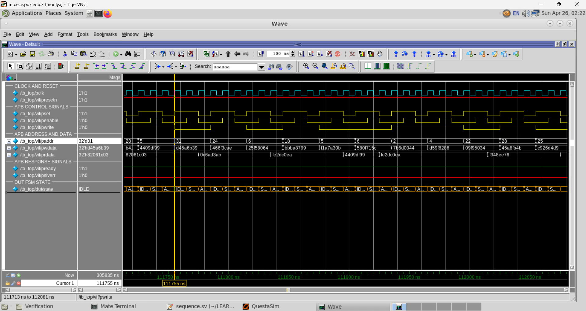

### Write Test (apb_write_test) — All 32 Addresses Written:
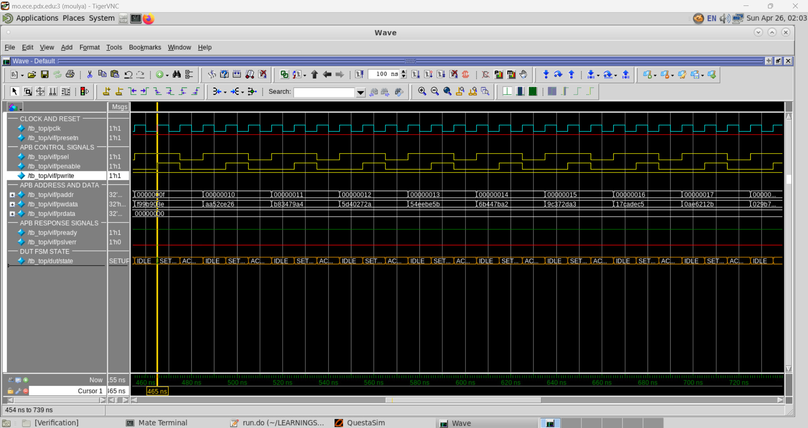

### Read Test (apb_read_test) — Write then Read All Addresses:
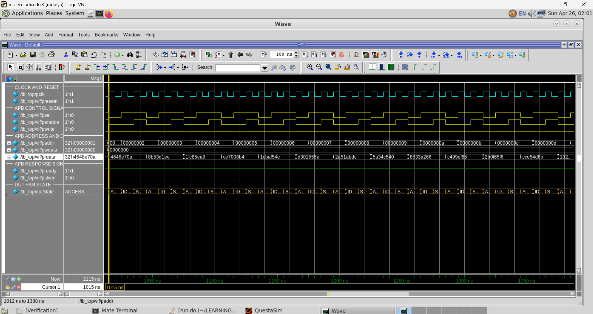

### Error Test (apb_error_test) — Out of Bounds → PSLVERR:
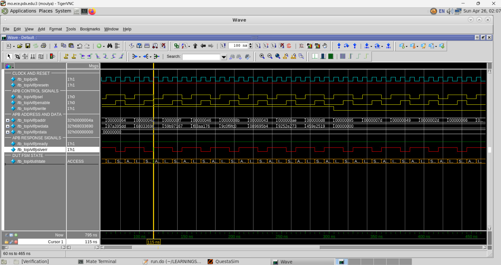

### Stress Test (apb_stress_test) — 50000 Random Transactions:
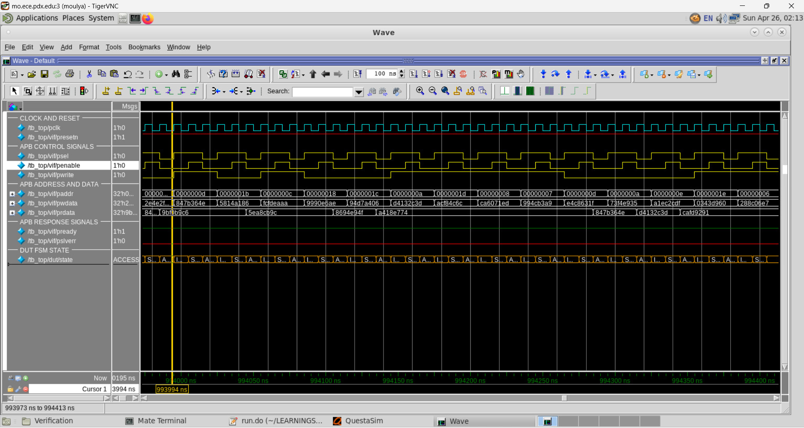

## How to Run

### Prerequisites:
- QuestaSim 10.6b or higher
- Linux environment

### Single Test:
```bash
cd Testbench/
vsim -c -do run.do    # batch mode
vsim -do run.do       # GUI mode
```

### Change Test:
Edit `run.do` Step 7:
```tcl
+UVM_TESTNAME=apb_test        # main coverage test
+UVM_TESTNAME=apb_write_test  # write test
+UVM_TESTNAME=apb_read_test   # read test
+UVM_TESTNAME=apb_error_test  # error test
+UVM_TESTNAME=apb_stress_test # stress test
```

### Full Regression:
```bash
cd Testbench/
vsim -c -do regression.do
```

### Check Results:
```bash
grep "TEST_STATUS" transcript
grep "COV_REPORT" transcript
grep "UVM_ERROR" transcript
```

---

## Test Suite

| Test              | Sequence 						   | Transactions |            Purpose 				 |
|-------------------|----------------------------------|--------------|----------------------------------|
| `apb_test`        | `apb_seq`                        | 10000+       | Coverage closure — all scenarios |
| `apb_write_test`  | `apb_write_seq`                  | 32           | Write to every address 		     |
| `apb_read_test`   | `apb_write_seq` + `apb_read_seq` | 64		      | Write then read all addresses    |
| `apb_error_test`  | `apb_error_seq` 				   | 20 	      | Out of bounds → pslverr		  	 |
| `apb_stress_test` | `apb_stress_seq` 				   | 50000        | Heavy random load 		   	     |

### Sequence Scenarios (apb_seq):
1. **Random Read/Write** — 10000 random transactions
2. **Write After Read** — explicit WAR transitions
3. **Corner Data Values** — FFFF_FFFF, AAAA_AAAA, 5555_5555
4. **Data Transitions** — min→max, max→min, zero→nonzero
5. **Boundary Addresses** — addr=0 and addr=31
6. **Out of Bounds** — addr=32 (triggers pslverr)

---

## Tools Used

| Tool 			| Version 		 | Purpose 					|
|---------------|----------------|--------------------------|
| QuestaSim     | 10.6b 		 | Simulation			    |
| UVM 			| 1.2 (built-in) | Verification methodology |
| SystemVerilog | IEEE 1800-2012 | RTL + TB language	    |
| Linux 		| RHEL			 | OS					    |
| GVim 			| — 			 | Code editor 				|

---

## Key Learnings

- APB is a **non-pipelined** protocol — every transfer is independent
- **Code coverage** should only be collected on RTL — not on TB files
- **Functional coverage** and **code coverage** are complementary — not the same
- `randc` conflicts with `dist` constraints — use `rand` with `dist`
- A cross coverpoint between `wdata` and read direction is **physically impossible** — always use `ignore_bins` or remove such crosses
- **Directed sequences** are more effective than pure random for corner case coverage closure

---

## Author

**Moulya Raju**
Masters Student — ECE, Portland State University
*RTL Design & Verification Engineer*

---

## References

- [ARM AMBA APB Protocol Specification](https://developer.arm.com/documentation/ihi0024/latest/)
- [UVM 1.1d User Guide](https://www.accellera.org/images/downloads/standards/uvm/uvm_users_guide_1.1.pdf)
- [APB Protocol Reference](https://verificationforall.wordpress.com/apb-protocol/)
- [QuestaSim User Manual](https://www.mentor.com/products/fv/questa/)
